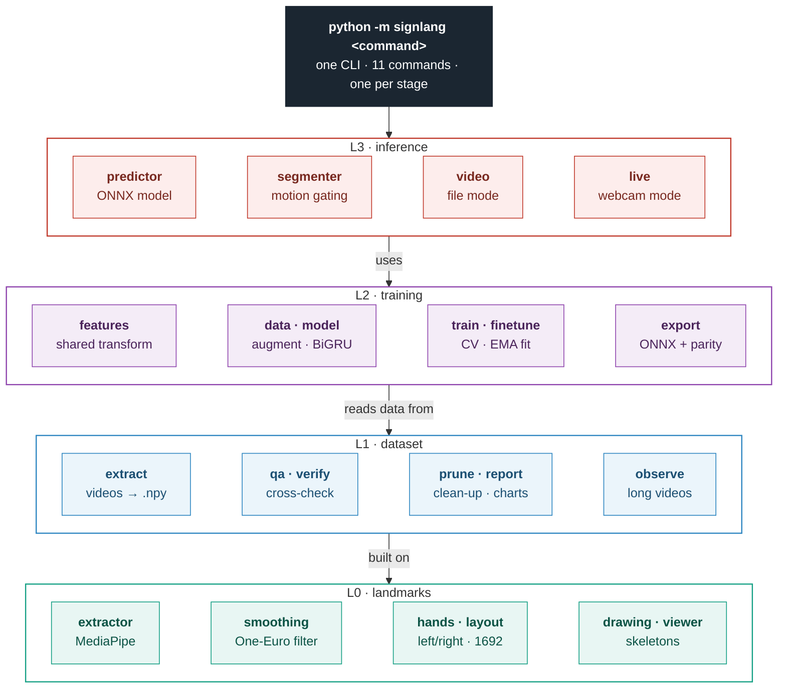
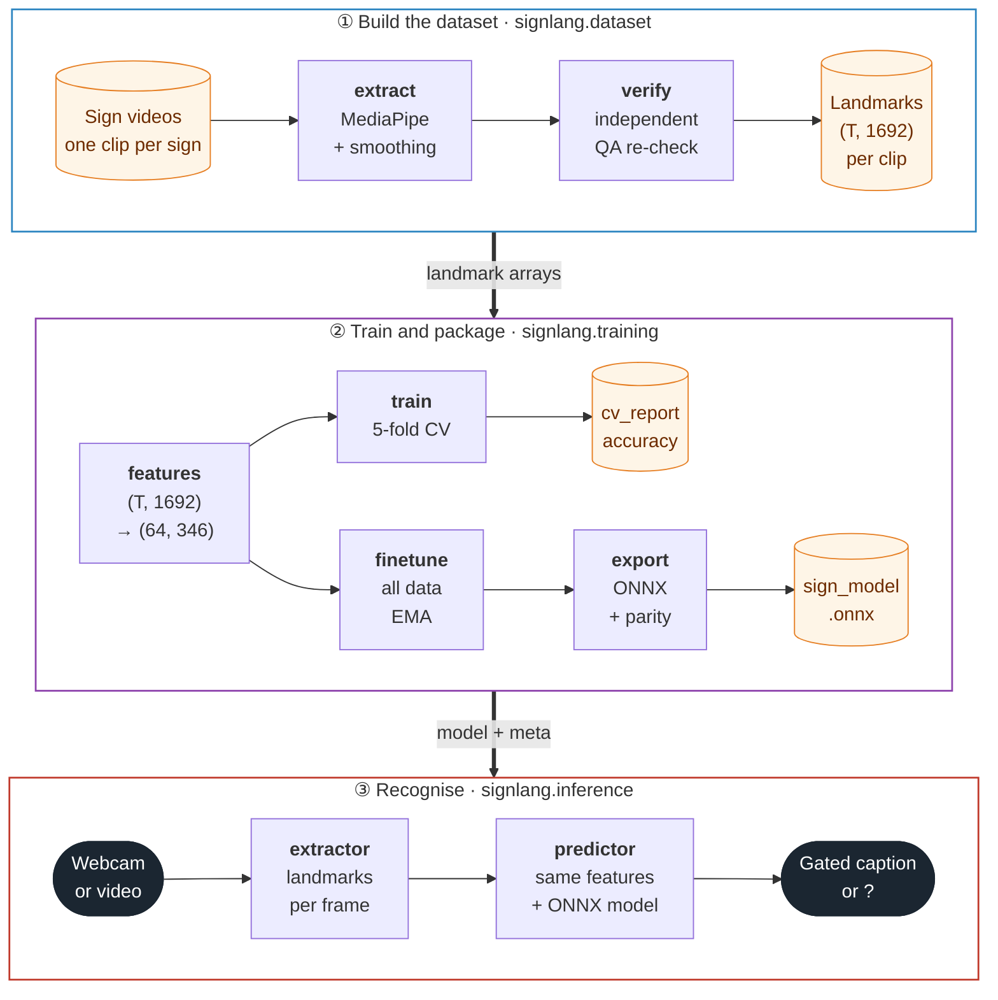
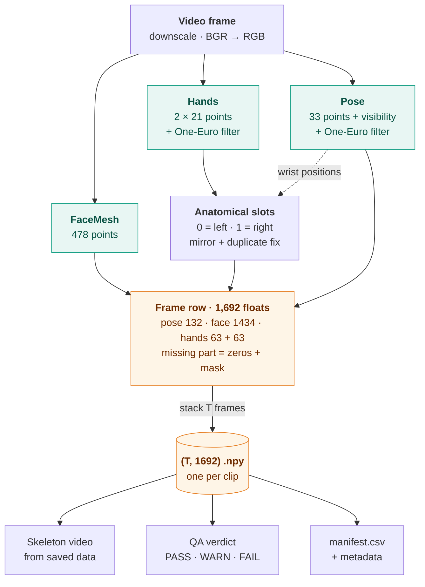
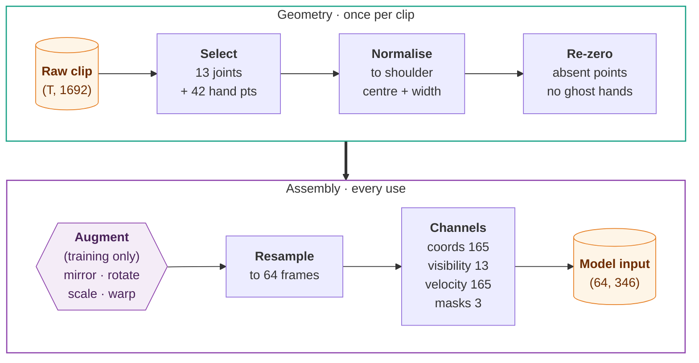
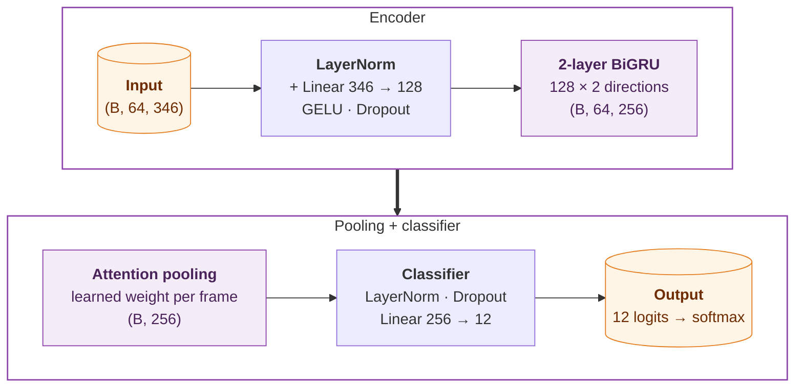
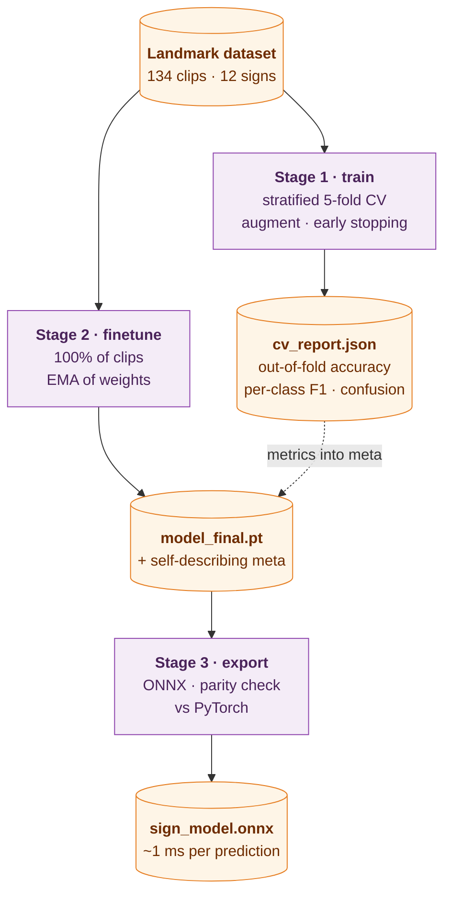
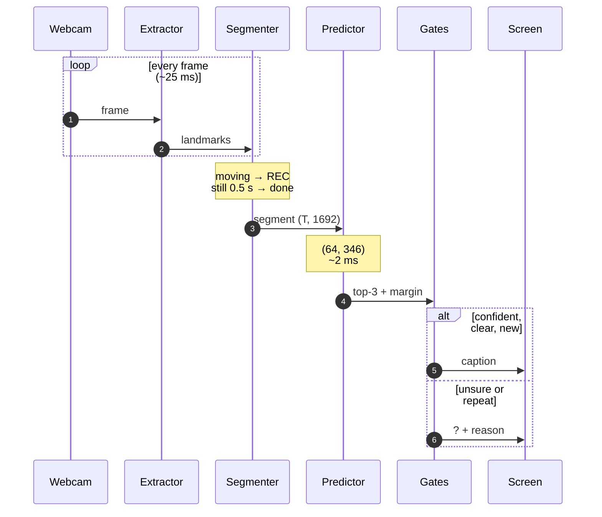
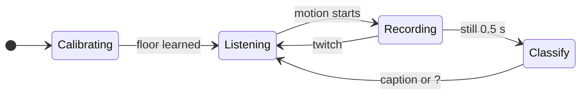
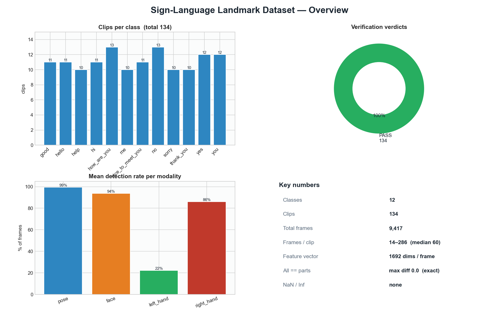
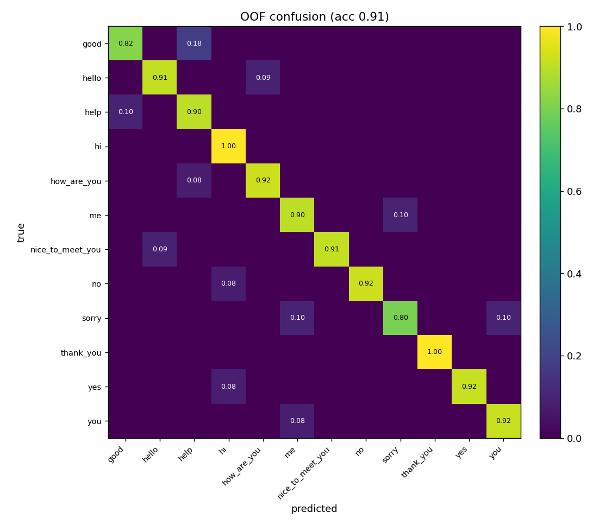

<div align="center">

# Sign Language Recognizer

### Real-time sign language recognition from body landmarks

**Sign videos → verified landmark dataset → BiGRU sequence model → ONNX → live webcam captions, all on a laptop CPU**

[](#quick-start)
[](#4-model)
[](#1-landmark-extraction)
[](#5-training-evaluation-and-export)
[](#tech-stack)
[](#testing)
[](CHANGELOG.md)

[Overview](#overview) · [Architecture](#system-architecture) · [Data pipeline](#how-the-data-flows) · [Results](#results) · [Quick start](#quick-start) · [Engineering notes](#engineering-challenges-and-lessons) · [Docs](docs/README.md)

</div>

---

## At a glance

| **91.0%** | **12** | **134** | **≈1 ms** | **≈2 ms** | **100** |
|:---:|:---:|:---:|:---:|:---:|:---:|
| out-of-fold accuracy<br/>(5-fold CV) | everyday signs | recorded clips | model inference<br/>(ONNX, CPU) | decision after a<br/>live sign ends | automated tests<br/>(no data needed) |

## Overview

Recognising sign language by computer is hard. A sign is defined by hand shape, hand
position, movement and sometimes facial expression, all changing over time. This project
builds a complete, working system for **isolated sign recognition** under realistic
constraints:

| Constraint | How the system handles it |
|------------|---------------------------|
| **Very little data** (≈11 clips per sign) | Learn from **skeleton landmarks**, not pixels; shoulder-normalised features; heavy augmentation, including a left↔right mirror; small regularised model |
| **Ordinary hardware** (laptop webcam, CPU only) | ≈0.5 M-parameter BiGRU exported to **ONNX** (≈1 ms per prediction); landmarks streamed at ≈25 ms per frame |
| **Live input has no boundaries** | **Motion-gated segmentation** finds where each sign starts and ends |
| **Wrong answers are worse than none** | Shows **"?"** when unsure (confidence, top-1 vs top-2 margin, hands visible); suppresses repeats |
| **Results must be trustworthy** | Stratified k-fold CV, an independent dataset verifier, and reports that compute every number they show |

### Why landmarks instead of pixels?

| | Raw pixels (1080p RGB frame) | MediaPipe landmarks (this project) |
|---|---|---|
| Values per frame | 6,220,800 | **1,692** (553 points) |
| Sensitive to background, lighting, clothing | yes | largely no |
| Data needed to train | typically thousands of videos | works with ≈10 per sign |
| Real-time on a laptop CPU | hard | yes |

## Key features

| Area | What it does |
|------|--------------|
| **Perception** | MediaPipe FaceMesh, Hands and Pose per frame. **One-Euro filtering** (no jitter, no lag). Handedness corrected for MediaPipe's mirrored-image assumption. **Duplicate hand labels resolved geometrically**, so no hand is ever lost. |
| **Data engineering** | One command turns a folder of videos into a `(T, 1692)` landmark dataset with per-clip QA, a skeleton video rendered from the saved data, and a manifest. Partial re-runs merge instead of overwriting. |
| **Verification** | An independent verifier checks NaN/Inf, frame counts, and that the combined vector equals its parts. It overlays saved points on the original video. Six infographics, computed from data only. Pruning is reversible. |
| **Learning** | One **shared feature transform** for training and serving (no train/serve skew). Shoulder normalisation, velocity channels, presence masks. BiGRU with attention pooling. Stratified 5-fold CV, then a final fit with **EMA** weights. |
| **Deployment** | Self-describing model package. ONNX export that **refuses a model that doesn't match PyTorch**. ≈1 ms inference on CPU. |
| **Real-time** | Streaming landmarks with persistent models. Motion-gated segments. Gates for confidence, margin and visible hands. Repeat suppression. Per-session diagnostic logs. |
| **Engineering** | Layered package with one CLI, configurable paths, pinned dependencies, **100 tests** on synthetic data, and documented design decisions. |

## System architecture

One Python package (`signlang`) in four layers. Each layer depends only on the layers below it, and every pipeline stage is a CLI command.



| Layer | Package | Responsibility |
|-------|---------|----------------|
| **L0** perception | `signlang.landmarks` | MediaPipe extractor, One-Euro smoothing (pure NumPy), left/right hand logic, the 1,692-column layout, skeleton drawing, live viewer |
| **L1** data engineering | `signlang.dataset` | Videos → verified landmark dataset: extraction, QA, verification, pruning, infographics, continuous-video analysis |
| **L2** learning | `signlang.training` | Feature transform, augmentation, BiGRU / Transformer, k-fold CV, EMA final fit, ONNX export |
| **L3** recognition | `signlang.inference` | Shared predictor, motion segmenter + de-duplication, file mode, live webcam mode |

**Design principles:**
- **One source of truth.** Shapes live in `layout.py`, hyper-parameters in `config.py`, and the feature transform in `features.py`, used by both training and inference.
- **Pure logic separated from I/O.** Smoothing, hand logic, QA, folds, metrics, the segmenter and the gates are all unit-tested without a camera, MediaPipe or data.
- **Self-describing artifacts.** A model file carries its classes, feature config and metrics, and the predictor rebuilds everything from it.

## How the data flows



**What the data looks like at every stage:**

| Stage | Representation | Shape / size |
|-------|----------------|--------------|
| Raw input | video frames (BGR) | 1920 × 1080 × 3, 14–286 frames per clip |
| Per frame | pose 33 × 4 · face 478 × 3 · hands 2 × 21 × 3 | **1,692** floats |
| Per clip | `processed_dataset/landmarks_all/<sign>/<clip>.npy` | **(T, 1692)** |
| Model input | normalised, resampled, + velocity + masks | **(64, 346)** |
| Model output | logits → softmax | 12 probabilities |
| Live decision | gates + de-duplication | a caption, or "?" with a reason |

### 1. Landmark extraction

`python -m signlang extract` runs this for every frame of every clip. Each clip gets fresh
models, so tracking state never leaks between clips.



- **One-Euro filter:** an adaptive low-pass filter whose cutoff rises with speed. Still hands are smoothed hard and fast hands barely at all, so there's no jitter and no lag. It is vectorised over all points; a point that jumps more than 0.3 is reset instead of smeared.
- **Anatomical hand slots:** MediaPipe labels handedness *as if the image were a mirrored selfie*, so labels are swapped for normal video. When both hands get the same label, they're separated by the nearest pose wrist, or by image position if the body isn't tracked.
- **Honest data:** a frame without a detection stays zero with its mask at 0. Nothing is back-filled.

### 2. Quality control

| Check | Verdict |
|-------|---------|
| NaN / Inf values, no frames, modalities with different frame counts, combined vector ≠ its parts | **FAIL** |
| Pose detected in < 50% of frames; face/hand coordinates far outside the image | **WARN** |
| Everything else | **PASS** |

`verify --overlay` draws the **saved** points on the **original** video, which is the eyes-on
proof that the numbers track the signer. `report` renders six infographics from the
metadata. `prune` moves bad clips to `excluded_clips/`, where they can be restored.

### 3. Feature engineering

The **same function** turns a clip into model input during training, file inference and live inference.



| Block | Width | Content |
|-------|------:|---------|
| Coordinates | 165 | 55 points × (x, y, z): nose, shoulders, elbows, wrists, hand roots + 21 + 21 hand points |
| Visibility | 13 | pose confidence for the 13 body joints |
| Velocity | 165 | frame-to-frame motion of every coordinate |
| Presence masks | 3 | is the pose / left hand / right hand visible in this frame |

**Why normalise, then re-zero?** Normalising to the shoulders makes features independent
of where the signer stands and how big they appear. But a *missing* hand is stored as
zeros, and normalisation would move it to a fixed "ghost" position the model could learn
from. So absent points are re-zeroed after normalisation and after every augmentation.

### 4. Model



543,553 parameters, regularised with dropout (0.4), label smoothing (0.05), augmentation
and EMA. The attention layer learns which frames of a sign matter most. A Transformer
encoder is available with `--arch transformer`.

### 5. Training, evaluation and export



<details>
<summary><b>Training recipe</b> (click to expand)</summary>

| Setting | Value |
|---------|-------|
| Optimiser | AdamW, lr 1.5e-3, weight decay 1e-4 |
| Schedule | 5-epoch linear warm-up → cosine decay to 1e-5 |
| Loss | cross-entropy, label smoothing 0.05 |
| Batch / epochs | 16 / up to 120, early stopping (patience 35) on validation accuracy |
| Regularisation | dropout 0.4, gradient clipping 5.0, EMA (decay 0.999 with warm-up) |
| Augmentation | mirror with left↔right swap (p = 0.5), rotation ±13°, scale ±12%, shift ±0.06, jitter σ 0.012, time-warp 15%, frame drop 7% |
| Evaluation | stratified 5-fold; every clip predicted exactly once, out-of-fold |
| Export | ONNX opset 17, dynamic batch; refused unless max logit difference vs PyTorch < 1e-3 |

</details>

**Why two training stages?** With ≈11 clips per sign, a single train/test split is
mostly noise. Cross-validation measures the recipe honestly, because every clip is
tested once by a model that never saw it. A separate run then trains the model you
ship on *all* the data.

### 6. Real-time recognition

`python -m signlang live` processes every camera frame as it arrives. When a sign ends,
its landmarks are already in memory, so only the tiny model runs.



The **motion segmenter** decides when a sign starts and ends:



| Gate | Rule | Otherwise shows |
|------|------|-----------------|
| Hands visible | a hand in more than 15% of the segment's frames | `? no-hands` |
| Confidence | top-1 probability ≥ 0.55 | `? low-conf` |
| Margin | top-1 − top-2 ≥ 0.15 (rejects look-alike ties) | `? tie` |
| De-duplication | the same sign again within 4 s is a repeat | suppressed |

Live mode took **three iterations**. [docs/LIVE_RECOGNITION.md](docs/LIVE_RECOGNITION.md) tells the story:

| | Fixed 2.5 s windows | Motion-gated (v0.1) | Streaming (v0.2, current) |
|---|---|---|---|
| Segments | cut signs in half | one segment per sign | one segment per sign |
| Idle or resting hands | kept printing the last word | ignored | ignored |
| Work per decision | temp video + re-extraction per window | temp video + 3 new models + re-extraction | **model only (≈2 ms)** |
| Preview while classifying | frozen | frozen (≈2.5 s for a 2 s sign) | **never frozen** |

## Results

Original run: **12 signs, 134 clips, 1 signer**, evaluated with stratified 5-fold cross-validation.

| Metric | Value |
|--------|-------|
| Out-of-fold accuracy | **0.910** |
| Out-of-fold macro-F1 | **0.909** |
| Per-fold accuracy | 0.906 · 0.893 · 0.962 · 0.875 · 0.917 (mean 0.911 ± 0.029) |
| Best / hardest sign | *thank_you* F1 1.00 · *help* F1 0.82 |
| Dataset QA | 134 / 134 PASS · pose detected in 99.4% of frames |
| ONNX vs PyTorch | max logit difference 1.7e-6 |

<p align="center">
  
</p>
<p align="center"><sub><b>Dataset QA</b>: 10–13 clips per sign, all 134 verified PASS, pose tracked in 99% of frames. The low left-hand rate reflects right-hand-dominant signing.</sub></p>

<p align="center">
  
</p>
<p align="center"><sub><b>Out-of-fold confusion matrix</b>: every clip predicted by a model that never saw it.</sub></p>

The remaining errors are look-alike pairs: *good ↔ help*, *me ↔ sorry*,
*hello ↔ how_are_you*. That's exactly why live mode shows "?" when the top two
predictions are close.

> **Reading these numbers honestly.** Every clip came from one signer, so 91% is a
> *within-signer* result. It shows the pipeline learns the signs; accuracy on new people
> is not yet measured. The recorded videos and trained weights aren't in the repository
> (personal video data); the committed reports are the record of the run. Details:
> [docs/RESULTS.md](docs/RESULTS.md).

## Quick start

**Prerequisites:** Python 3.10–3.12 (tested on 3.11, Windows 11), a webcam for live mode. No GPU needed.

```bash
git clone https://github.com/satyaidk/sign-language-translation.git
cd sign-language-translation
python -m venv .venv
.venv\Scripts\activate                  # Linux/macOS: source .venv/bin/activate
pip install -r requirements-dev.txt     # runtime + pytest
python -m signlang --help
```

> MediaPipe is pinned to **0.10.9** because newer releases removed the API this project
> uses. Keep only `opencv-contrib-python` installed; installing `opencv-python`
> alongside it breaks `cv2`.

**1. Add data.** Put one folder per sign, with one short clip per recording:

```
dataset/
├── hello/       hello_01.mp4  hello_02.mp4  ...
├── thank_you/   ...
└── yes/         ...
```

**2. Run the pipeline:**

```bash
python -m signlang extract     # videos -> landmark dataset (+ skeleton videos, QA)
python -m signlang verify      # independent cross-check      (+ `report` for charts)
python -m signlang train       # 5-fold cross-validation      -> artifacts/metrics/
python -m signlang finetune    # final model on all data (EMA)
python -m signlang export      # ONNX + parity check          -> artifacts/exported/
python -m signlang live        # real-time webcam recognition (press Q to quit)
```

**No data yet?** `python -m pytest -q` runs the whole pipeline end-to-end on synthetic data.

<details>
<summary><b>All CLI commands</b></summary>

| Command | Layer | What it does |
|---------|:-----:|--------------|
| `view` | L0 | Live landmark viewer for a webcam, video or image |
| `extract` | L1 | Videos → landmark dataset (+ skeleton videos, QA, manifest) |
| `verify` | L1 | Independent cross-check; `--overlay` for eyes-on proof |
| `prune` | L1 | Reversibly drop bad clips (`--dry-run` to preview) |
| `report` | L1 | Six dataset / verification infographics |
| `observe` | L1 | Analyse one long, continuous-signing video |
| `train` | L2 | Stage 1: stratified k-fold cross-validation |
| `finetune` | L2 | Stage 2: final model on all data with EMA |
| `export` | L2 | Stage 3: ONNX export + parity check + latency |
| `video` | L3 | Recognise a video file: prediction, timeline, overlay |
| `live` | L3 | Real-time webcam recognition with session logs |

Every command has `--help`. Paths can be changed with `--dataset-dir`, `--processed-dir`
and `--artifacts-dir`, or the `SIGNLANG_*_DIR` environment variables. The full guide is in
[docs/README.md](docs/README.md).

</details>

## Project structure

```
sign-language-translation/
├── signlang/                   the package ─ python -m signlang <command>
│   ├── landmarks/              L0  extractor · smoothing · hands · layout · drawing · viewer
│   ├── dataset/                L1  extract · qa · verify · prune · report · observe
│   ├── training/               L2  features · data · model · train · finetune · export · viz
│   ├── inference/              L3  predictor · segmenter · video · live
│   ├── config.py               paths + every hyper-parameter
│   └── utils.py                folds, metrics, IO
├── tests/                      100 pytest tests on synthetic data (fakes for camera, model, MediaPipe)
├── docs/                       how-to-run guide, architecture, pipeline, live recognition, results
├── processed_dataset/          dataset metadata, QA reports, infographics (arrays git-ignored)
├── artifacts/                  metrics, confusion matrix, model meta (weights git-ignored)
├── build_docs/                 product + engineering plan for the next version
└── requirements.txt · requirements-dev.txt · pyproject.toml · CHANGELOG.md
```

## Testing

```bash
python -m pytest -q        # 100 passed in ~20 s. No private data, camera or model needed.
```

| Suite | Covers |
|-------|--------|
| `test_landmarks` · `test_extractor` | layout, One-Euro behaviour, hand-slot assignment (incl. duplicate labels), MediaPipe result conversion, real extraction on a synthetic video |
| `test_dataset` | extraction bookkeeping (merge, append-only labels, resume), QA verdicts, the verifier catching corruption, pruning |
| `test_training` | configs, folds, metrics vs hand-computed values, feature invariances, "ghost hand", augmentation, model, LR schedule, EMA |
| `test_inference` | segmenter, debouncer, gate reasons, `LiveRecognizer` end-to-end with fakes |
| `test_pipeline` | synthetic dataset → CV → final fit → ONNX export → predictor (ONNX ≡ PyTorch) |
| `test_cli_and_reports` | every CLI command, report numbers read from files |

Several tests are named after the bug they pin down. See [CHANGELOG.md](CHANGELOG.md).

## Tech stack

| Purpose | Tools |
|---------|-------|
| Perception | MediaPipe 0.10.9 (FaceMesh · Hands · Pose), OpenCV |
| Numerics | NumPy (metrics and folds implemented directly, no scikit-learn) |
| Learning | PyTorch (BiGRU / Transformer, AdamW, EMA) |
| Deployment | ONNX, ONNX Runtime (CPU) |
| Visualisation | Matplotlib |
| Quality | pytest (100 tests), pinned requirements, CHANGELOG, Mermaid architecture docs |

## Engineering challenges and lessons

| # | Challenge | What I did | Lesson |
|:-:|-----------|------------|--------|
| 1 | Jittery skeletons; arms crossing into an "X" | One-Euro filter, visibility-gated bones, optimal two-hand ↔ arm assignment | Clean input beats a clever model |
| 2 | Left and right hands swapped; one hand silently lost on duplicate labels | Corrected MediaPipe's mirror assumption; geometric tie-break; regression tests | Read a model's assumptions and test the edge cases of third-party output |
| 3 | Only 134 clips | Landmarks, shoulder normalisation, mirror augmentation with hand swap, small model, k-fold CV | With small data, the evaluation protocol matters as much as the model |
| 4 | Normalisation turned missing hands into "ghost hands" | Re-zero absent points after normalising and after every augmentation | "Absent" needs an explicit representation |
| 5 | Training and serving could drift apart | One feature transform with no fitted state + a self-describing model file | Make the deployed model rebuild its own inputs |
| 6 | Live mode printed stale and blended words, then froze after every sign | Three iterations: fixed windows → motion-gated segments + "?" gates → streaming landmarks (≈2 ms decision) | Define the unit of work (the sign, not the clock) and measure where time goes |
| 7 | Numbers that looked better than they were | Removed hard-coded "all passed" chart text; labelled training-fit accuracy; stated the one-signer limit | Report what you measured, and how |
| 8 | Dependency churn (MediaPipe API removed, ONNX exporter deprecated, int8 not helping GRUs) | Pinned versions, clear failure messages, MediaPipe isolated behind one class, measured before claiming | Isolate what you can't control |
| 9 | A folder of scripts with hidden bugs | Refactored into a layered, tested package; the tests found label renumbering, truncated manifests and two crashes | Writing tests is a code review |

## Limitations and roadmap

- **Generalisation to new signers is unmeasured.** The data has one signer. Next: several signers and a signer-independent test split.
- **One sign language per label set.** The original 12 classes mixed ASL with a few ISL signs.
- **No "not signing" class.** The gates reduce false captions from non-sign motion but can't remove them entirely.
- **Isolated signs only.** Continuous signing needs a sequence-to-sequence model or sign spotting.
- **Legacy MediaPipe API.** Moving to the MediaPipe Tasks API only touches the extractor module.

The [`build_docs/`](build_docs/) folder contains the product and engineering plan for the
next version (PRD, technical requirements, architecture, rules, implementation plan,
tasks and test strategy). It describes a **language-agnostic** platform that trains one
sign language at a time and co-trains several sign languages through a shared encoder
with one output head per language.

## Documentation

| Document | Contents |
|----------|----------|
| [docs/README.md](docs/README.md) | How to run: installation, every command, outputs, troubleshooting |
| [docs/ARCHITECTURE.md](docs/ARCHITECTURE.md) | Layers, module map, design decisions, known limitations |
| [docs/PIPELINE.md](docs/PIPELINE.md) | Each stage in depth: extraction, QA, features, augmentation, model, training, export |
| [docs/LIVE_RECOGNITION.md](docs/LIVE_RECOGNITION.md) | Real-time recognition, its three iterations, and tuning |
| [docs/DATA_FORMATS.md](docs/DATA_FORMATS.md) | Every file the pipeline reads and writes |
| [docs/RESULTS.md](docs/RESULTS.md) | Measured results and how to read them |
| [docs/DEVELOPMENT.md](docs/DEVELOPMENT.md) | Tests, conventions, extending the project |
| [CHANGELOG.md](CHANGELOG.md) | Version history and every bug fixed |

## Acknowledgements

- [MediaPipe](https://github.com/google-ai-edge/mediapipe) by Google, for the face, hand and pose landmark models.
- Casiez, Roussel & Vogel (2012), *1€ Filter: A Simple Speed-based Low-pass Filter for Noisy Input in Interactive Systems*, the smoothing used throughout.
- [PyTorch](https://pytorch.org/) and [ONNX Runtime](https://onnxruntime.ai/).

---
