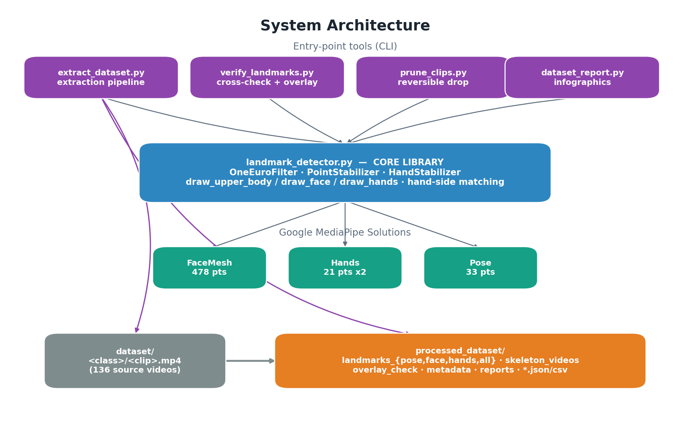

# 02 — Architecture

## Layers

The system is deliberately layered so the detection logic is written once and
reused everywhere.

1. **MediaPipe Solutions** (third-party) — `FaceMesh`, `Hands`, `Pose`. These do
   the actual neural-network landmark detection on each RGB frame.

2. **Core library — `landmark_detector.py`** — wraps MediaPipe and adds the
   project's own logic: temporal smoothing (One-Euro filter), occlusion
   persistence, anatomical hand↔body matching, and all the drawing routines.
   It is also a standalone live viewer (`python landmark_detector.py`).

3. **Entry-point tools** — small CLIs that each do one job and all build on the
   core library:
   - `extract_dataset.py` — batch-extract the dataset.
   - `verify_landmarks.py` — verify and visualise the output.
   - `prune_clips.py` — curate the dataset.
   - `dataset_report.py` — summarise quality as charts.

4. **Data stores** — `dataset/` (input videos) and `processed_dataset/`
   (every output artifact).

## Module responsibilities

| Module | Responsibility | Depends on |
|--------|----------------|------------|
| `landmark_detector.py` | Detect, smooth, match, draw. Reusable building blocks. | MediaPipe, OpenCV |
| `extract_dataset.py` | Walk dataset, run detection, save `.npy` + skeleton + QA. | core lib, NumPy |
| `verify_landmarks.py` | Structure / consistency / detection checks + overlay. | core lib, NumPy |
| `prune_clips.py` | Move source out, delete artifacts, refresh reports. | stdlib only |
| `dataset_report.py` | Read metadata/reports, render infographics. | matplotlib, NumPy |

## Design principles

- **Single detection pass per clip.** Face, hands and pose are extracted
  together, then sliced into the separate folders *and* concatenated into the
  combined vector. The per-modality files and the combined file therefore can
  never disagree (verified: max diff `0.0`).

- **Verification is rendered from the saved data, not re-detected.** The
  skeleton and overlay videos are drawn *from the `.npy` arrays*, so watching
  them is literally a view of the file contents — a true proof, not a second
  opinion.

- **Honest masks.** Occlusion "hold" is disabled during extraction, so a frame
  with no detection is stored as zeros and flagged in the mask, rather than
  back-filled with stale points. Detection rates are therefore truthful.

- **Reversibility.** Pruning *moves* source videos to `excluded_clips/` instead
  of deleting them; the operation can be undone.

- **Reproducibility.** Every output folder is regenerable from `dataset/` by
  re-running the tools. Nothing in `processed_dataset/` is hand-edited.

## Coordinate & feature conventions

All landmarks are MediaPipe **normalised image coordinates**: `x, y ∈ [0, 1]`
(fraction of width/height), `z` a relative depth in roughly the same scale, and
pose landmarks additionally carry a `visibility ∈ [0, 1]`. These raw normalised
coordinates *are* the spatial features; any further normalisation (centering,
scaling) is left to the training pipeline and applied read-only from the files.

> Note: pose `x/y` can legitimately fall outside `[0, 1]` — MediaPipe
> extrapolates joints that are off-screen (e.g. hips below an upper-body frame).
> Range checks therefore apply to face/hands only.
