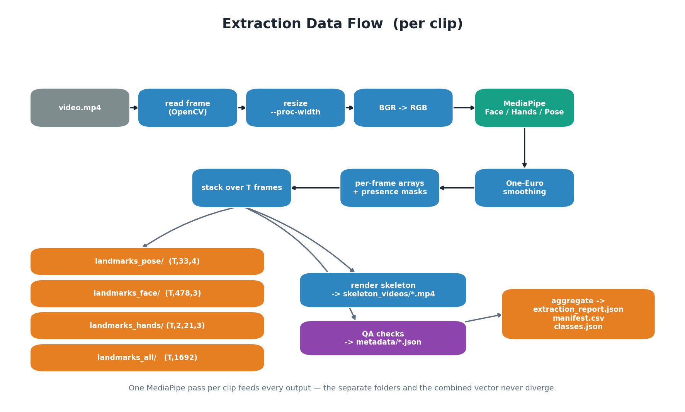

# 03 — Processing Pipeline

This is what happens for **one clip** inside `extract_dataset.py`
(`extract_clip()`), and how clips are aggregated.

## Per-clip steps

1. **Open the video** with OpenCV; read the source FPS (clamped to a sane range,
   default 30).

2. **Create fresh MediaPipe models** for this clip (`build_models`). Models are
   recreated per clip so temporal tracking state never leaks from one clip into
   the first frames of the next.

3. **Create fresh smoothing state** — one `PointStabilizer` for pose and a
   `HandStabilizer` for hands (`hold_frames=0`, so missing detections are not
   back-filled). Disabled by `--no-smooth`.

4. **For each frame** (timestamp `t = frame_index / fps`):
   - Optionally **downscale** to `--proc-width` (normalised coords are
     resolution-independent, so this only changes speed).
   - Convert **BGR → RGB**.
   - Run **FaceMesh / Hands / Pose** (whichever are enabled).
   - **Pose** → smooth with One-Euro → write `(33, 4)` row `[x, y, z, visibility]`;
     set the pose mask for this frame if detected.
   - **Face** (first face only) → write `(478, 3)` `[x, y, z]`; set the face mask.
   - **Hands** → each detected hand is mapped to an **anatomical slot**
     (Left = 0, Right = 1) via `anatomical_label()`; write `(21, 3)` into that
     slot and set the corresponding hand mask. Missing hand = zeros, mask 0.

5. **Stack** all per-frame arrays over `T` frames.

6. **Save the four `.npy` files**: `pose (T,33,4)`, `face (T,478,3)`,
   `hands (T,2,21,3)`, and the **combined** `all (T,1692)` built by
   `build_all_vector()` (concatenation order: pose | face | left | right).

7. **Render the skeleton video** (`render_skeleton`) from the *saved arrays* onto
   a black canvas, reusing the core library's `draw_*` functions.

8. **Run QA** (`qa_clip`): detection rates, coordinate ranges, NaN/Inf check, and
   a `PASS / WARN / FAIL` verdict. Write `metadata/<class>/<stem>.json`.

## Aggregation

After all clips: write `classes.json` (class→label), `FEATURE_LAYOUT.json`
(column layout of the combined vector), `manifest.csv` (one row per clip),
`extraction_report.json` (dataset-wide verdicts + mean detection rates), and a
`README.md`.

## Key algorithms (in `landmark_detector.py`)

### One-Euro filter (`OneEuroFilter`)
An adaptive low-pass filter. It smooths hard when a point is nearly still (kills
jitter) and barely filters when a point moves fast (no lag). Each landmark's
`x` and `y` are filtered independently. A large jump resets the filter so it
does not smear across a teleport.

### Point stabiliser (`PointStabilizer`)
Wraps one One-Euro pair per landmark for a fixed-size set (e.g. 33 pose points),
plus optional **occlusion hold** (kept at 0 for extraction) and EMA-smoothed
visibility. Returns a MediaPipe `NormalizedLandmarkList` proto.

### Hand stabiliser (`HandStabilizer`)
Keeps one `PointStabilizer` per hand, keyed by MediaPipe's handedness label, so
each hand is smoothed independently across frames.

### Anatomical hand assignment (`anatomical_label`, `match_hands_to_sides`)
MediaPipe reports handedness assuming a mirrored (selfie) image. For raw video
the label is swapped to the person's true side. `match_hands_to_sides()` then
assigns each detected hand to the nearest body wrist using an optimal two-hand
pairing, so the arm chains never cross into an "X".

### Skeleton rendering from arrays (`render_skeleton`)
Rebuilds proto objects from the saved arrays and calls the same
`draw_upper_body` / `draw_face` / `draw_hands` used by the live viewer
(`show_labels=False` for clean output). Because it draws the saved numbers, the
video is a faithful visualisation of the `.npy` file.
