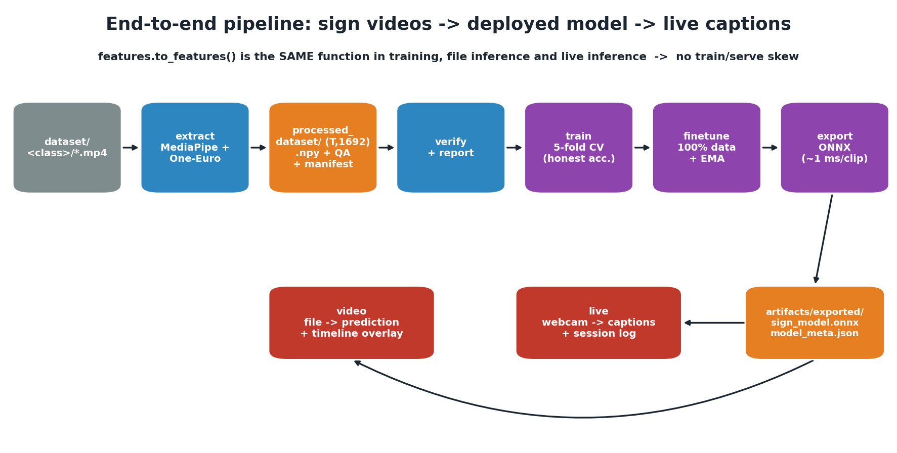

# Architecture


The code is one Python package, `signlang`, in four layers. Each layer only uses
the layers below it, and every stage is a sub-command of `python -m signlang`.

| Layer | Package | Responsibility |
|-------|---------|----------------|
| **L0 Landmarks** | `signlang.landmarks` | MediaPipe detection, One-Euro smoothing, hand-side logic, drawing, live viewer |
| **L1 Dataset** | `signlang.dataset` | Video dataset → verified landmark dataset, QA, reports, pruning |
| **L2 Training** | `signlang.training` | Feature transform, augmentation, model, cross-validation, final fit, ONNX export |
| **L3 Inference** | `signlang.inference` | Shared predictor, motion segmentation, file and live recognition |

Shared: `signlang/config.py` (paths + every hyper-parameter), `signlang/utils.py`
(seeding, folds, metrics, IO), `signlang/__main__.py` (CLI).

## Module map

```
signlang/
├── __main__.py            CLI: python -m signlang <command>   (stage modules imported lazily)
├── config.py              Paths (dataset/processed/artifacts, env + CLI overrides) · Feature/Model/TrainConfig
├── utils.py               UTF-8 console · seeding · stratified k-fold · metrics (no sklearn) · JSON/CSV IO
├── landmarks/             ── L0 ──
│   ├── layout.py          shapes, the 1692-column "all" vector, presence masks          (pure)
│   ├── smoothing.py       OneEuroFilter, PointStabilizer, HandStabilizer                (pure NumPy)
│   ├── hands.py           anatomical handedness, hand->slot and hand->arm assignment    (pure)
│   ├── mediapipe_compat.py  fails early and clearly if MediaPipe is missing / too new
│   ├── extractor.py       LandmarkExtractor: persistent models, frame -> FrameLandmarks; extract_video()
│   ├── drawing.py         skeleton / face / hands drawing, skeleton + side-by-side videos
│   └── viewer.py          `view`: interactive viewer with occlusion hold
├── dataset/               ── L1 ──
│   ├── extract.py         `extract`: per-clip extraction + merged dataset files
│   ├── qa.py              PASS/WARN/FAIL checks shared by extraction and verification
│   ├── verify.py          `verify`: structure + "all == parts" + detection rates (+ overlays)
│   ├── prune.py           `prune`: reversible clip removal + report refresh
│   ├── report.py          `report`: 6 infographics, every number read from files
│   └── observe.py         `observe`: one long continuous video + detection timeline
├── training/              ── L2 ──
│   ├── features.py        raw (T,1692) -> (L=64, D=346); geometric() / assemble() split for augmentation
│   ├── data.py            dataset index, geometry cache, augmentation, torch Dataset
│   ├── model.py           SignClassifier: LayerNorm -> MLP -> BiGRU|Transformer -> attention pool -> head
│   ├── train.py           `train`: stratified k-fold CV, out-of-fold report
│   ├── finetune.py        `finetune`: 100% fit with EMA weights
│   ├── export.py          `export`: ONNX, parity check, optional int8, latency
│   └── viz.py             confusion / fold / history plots
└── inference/             ── L3 ──
    ├── predictor.py       SignPredictor: meta-driven, ONNX or torch, robust window voting
    ├── segmenter.py       MotionSegmenter (adaptive noise floor, hysteresis) + SignDebouncer
    ├── video.py           `video`: whole-clip prediction, timeline, overlay
    └── live.py            `live`: LiveRecognizer (streaming), EmitGate, UI, session logs
```

## How the pieces connect



1. `extract` runs `LandmarkExtractor` on each clip and saves `(T, 1692)` landmark arrays + QA.
2. `train` / `finetune` read those arrays through **`features.to_features`**, the same
   function `video` and `live` use at inference, so there is no train/serve skew.
3. `export` writes `sign_model.onnx` + a self-describing `model_meta.json` (classes, feature
   config, sequence length, metrics). The predictor rebuilds everything from that meta.
4. `video` and `live` run the same extractor, transform and model.

## Design decisions

| Decision | Why |
|----------|-----|
| **Landmarks, not pixels** | 134 clips is far too little for a video CNN; skeletons are low-dimensional, background-independent and fast on a CPU. |
| **One shared feature transform** | Training and serving call the same `to_features`; the transform has no fitted state, so the model's meta fully describes it. |
| **Per-clip normalisation** (mid-shoulder origin, median shoulder width) | Position- and scale-invariant; robust to per-frame dropouts; absent hands are re-zeroed so they never become "ghost hands". |
| **Face off by default** | Face is 1,434 of 1,692 raw values; the 12-sign vocabulary is manual (hand-driven). It's one flag (`--use-face`) to include it. |
| **Small BiGRU + attention pooling (~0.54 M params)** | Right-sized for tiny data; heavy regularisation (dropout, label smoothing, augmentation, EMA). |
| **k-fold CV for evaluation, separate 100% fit for deployment** | With ~11 clips per class a single split is noise; out-of-fold predictions score every clip once. |
| **ONNX Runtime on CPU** | Framework-free deployment, ~1 ms per classification. |
| **Motion-gated segmentation + abstain + de-dup** | Fixed windows cut signs in half and kept emitting stale words (see [LIVE_RECOGNITION.md](LIVE_RECOGNITION.md)). |
| **Streaming landmark extraction in live mode** | Nothing is re-processed after a sign ends, so there is no freeze and no temp files. |
| **Pure logic separated from I/O** | Smoothing, hand logic, QA, folds, metrics, segmenter and gates are unit-tested without a camera, MediaPipe or data. |
| **No scikit-learn** | Folds and metrics are a few lines of NumPy; fewer dependencies. |
| **MediaPipe pinned to 0.10.9** | The legacy solutions API was removed upstream; `mediapipe_compat` turns the cryptic failure into an actionable one. |

## Known limitations

- **One signer.** The original dataset was recorded by one person, so the reported accuracy is within-signer. Generalisation to new people is unmeasured ([RESULTS.md](RESULTS.md)).
- **Mixed sign languages.** The 12 classes were mostly ASL with a few ISL variants. A future dataset should keep one sign language per label set.
- **No "not signing" class.** Large non-sign movements can be classified as a sign; the hands/confidence/margin gates reduce but don't eliminate this.
- **Isolated signs only.** Live mode needs a short pause between signs; continuous signing is out of scope.
- **Resolution.** The dataset is extracted at full resolution by default, while live mode detects at 480 px wide for speed. Extract with `--proc-width 480` if you want identical conditions.
- **Legacy MediaPipe API.** Upgrading means porting `landmarks/extractor.py` to the MediaPipe Tasks API. The rest of the code only sees `FrameLandmarks`, so the change stays contained.
