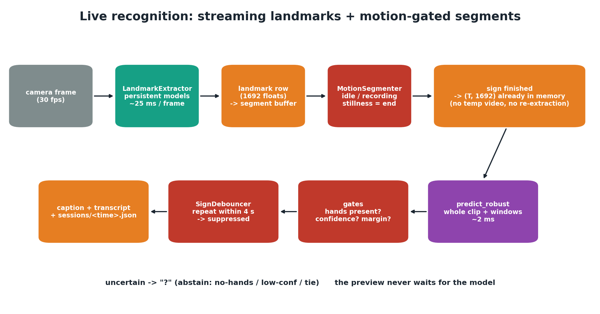

# Live recognition

Live mode turns a webcam stream into captions, one isolated sign at a time. Getting
this right took three iterations. That history is the most instructive part of
the project, so it's documented here.

## Iteration 1: fixed windows (the naive version)

Record 2.5 s, classify it, show the word, repeat. Three problems appeared in testing:

1. **Signs blended.** A fixed window doesn't line up with where a sign starts and
   stops, so one chunk held the *tail* of one sign and the *start* of the next.
2. **The previous word stuck.** The model has no "not signing" class, so a window of
   resting hands was still forced into one of the 12 words. A still hand keeps
   looking like the last sign.
3. **Repeats spammed.** Every window emitted independently, so holding or repeating
   a sign printed it again and again.

The root cause was **segmentation**: classifying on a clock instead of on the sign.

## Iteration 2: motion-gated segments, abstention, de-duplication

- **`MotionSegmenter`:** a cheap per-frame motion signal (mean absolute difference of
  blurred 120-px grayscale frames). A recording **opens when the hands start
  moving and closes when the signer goes still**, so a segment lasts exactly as
  long as the sign.
  - *Adaptive noise floor:* the idle baseline follows lulls down quickly and rises
    only very slowly. With a plain running average, a sign inflated its own
    threshold and a small, distant signer never triggered a recording.
  - *Hysteresis:* start at 2.6× the floor, stop below 1.7×, so the state doesn't flicker.
  - *Pre-roll* (0.25 s) keeps the sign's onset; trailing stillness is trimmed.
  - *Limits:* shorter than 0.5 s = twitch (discarded); longer than 5 s is force-closed.
- **Robust classification:** the whole segment plus overlapping sub-windows,
  softmax-averaged (`predict_robust`).
- **Emit gates:** a sign is shown only if hands were visible in more than 15% of
  frames, top-1 probability ≥ 0.55 and top-1 − top-2 ≥ 0.15. Otherwise "?" is
  shown. A near-tie between look-alikes (e.g. *good*/*help*) is refused, not guessed.
- **`SignDebouncer`:** the same sign again within 4 s is one sign ("no, no, no" → "no").
- **Clear UI states:** LISTENING (grey) → REC with a motion bar → the recognised sign
  flashes green → running transcript. A stale word can't look live.

## Iteration 3: streaming landmarks (this refactor)

Iteration 2 still had a structural flaw. When a segment closed, the loop:
1. wrote the frames to a temporary MP4;
2. re-opened it and created **three new MediaPipe models**;
3. re-extracted every frame (≈40 ms per frame on the reference laptop).

That all ran **on the capture thread**, so a 2 s sign froze the preview for about
2.5 s, and any sign made during the freeze was lost.

Now `LiveRecognizer` keeps **one persistent `LandmarkExtractor`** and extracts
landmarks from every frame as it arrives. The segmenter buffers landmark rows
instead of images, so when a sign ends the `(T, 1692)` array is already in
memory, and only the model runs.

| | Iteration 2 | Iteration 3 |
|---|---|---|
| Work after a sign ends | re-encode + re-extract every frame (≈40 ms/frame) + model | model only (**≈2 ms** measured) |
| Preview during classification | frozen | keeps running |
| MediaPipe models per sign | 3 created and destroyed | 0 (persistent) |
| Temp files | one MP4 per sign | none |
| Face mesh | always run, then ignored by the model | skipped when the model doesn't use the face |
| Per-frame landmark cost (720p→480 px, synthetic frames) | n/a | **≈25 ms (≈40 fps)** |

Other fixes in the same pass:
- **Wrong abstain reason.** The old code printed "tie" for any confidence ≥ 0.5, even
  when confidence (0.55 threshold) or missing hands was the real cause. `EmitGate`
  now reports `no-hands`, `low-conf` or `tie` correctly.
- **Non-reproducible file runs.** `--source` de-duplicated repeats with the wall clock
  (plus a fudge offset), so results depended on processing speed. File mode now uses
  the video's own timeline.
- **Fallback bug.** When no segment was detected in a file, the whole clip was
  classified with a hard-coded `hands_rate = 1.0`, bypassing the hands gate. The
  fallback now measures it.
- **Session logs.** Every run writes `predictions/sessions/<time>.json` with one record
  per segment: timing, top-3, confidence, margin, hands rate, decision, reason and
  classification time. Tuning thresholds now starts from data, not guesses.

## Tuning quick reference

| Symptom | Try |
|---------|-----|
| A sign is split into two | `--still 0.7` (longer stillness needed to end a sign) |
| Signs start late or are missed | `--motion-start 2.2` or `--floor 0.0015` |
| Random movement triggers recordings | `--motion-start 3.0`, `--min-sign 0.6` |
| Look-alike signs show the wrong word | `--margin 0.2` (abstain more often instead) |
| Too many "?" | `--margin 0.1`, `--conf 0.5` |
| An intentional repeat is swallowed | `--repeat-window 2.0` |

## Remaining limits

- Frame-difference motion reacts to any large movement (head, body, other people).
  A natural next step is gating on **hand-landmark velocity**, now possible because
  landmarks are available for every frame.
- No "not signing" class: a trained background class would reject non-sign motion
  better than thresholds.
- Signs need a short pause between them; continuous signing needs a sequence model.
