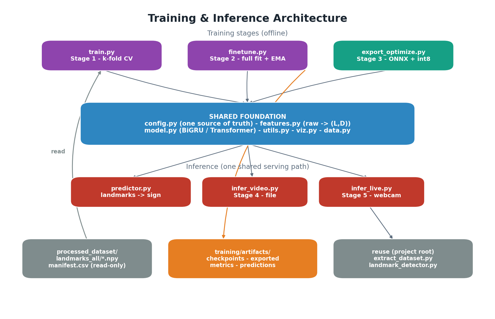

# 02 — Architecture



## Layers

The training layer is organised so the **feature transform and the model are
each written once** and reused by every stage. Training and inference are not
two code paths — they are the same path with augmentation toggled on/off.

1. **Shared foundation** — `config.py`, `features.py`, `model.py`, `utils.py`.
   These define *what a feature is*, *what the model is*, and *the conventions*.
   Everything else imports them.

2. **Training stages** — `train.py` (k-fold CV) and `finetune.py` (full-data
   fit). They wrap the foundation with data loading (`data.py`), augmentation,
   schedules, EMA, and metrics (`viz.py`).

3. **Deployment** — `export_optimize.py` freezes the trained weights into a
   framework-free ONNX model with a self-describing `model_meta.json`.

4. **Inference** — `predictor.py` is the single serving entry point; `infer_video.py`
   and `infer_live.py` are thin CLIs over it.

5. **Cross-project reuse** — inference calls back into the extraction project
   (`extract_dataset.extract_clip`, `landmark_detector`) to turn a video into the
   same `(T, 1692)` raw vector the dataset was built from.

```
            ┌──────────────── shared foundation ────────────────┐
            │ config.py   features.py   model.py   utils.py      │
            └───────────────────────────────────────────────────┘
                 │            │            │            │
   ┌─────────────┴──┐   ┌─────┴─────┐  ┌───┴────┐  ┌────┴─────┐
   │  TRAIN (1,2)   │   │ DATA      │  │ EXPORT │  │ INFER     │
   │ train.py       │──▶│ data.py   │  │ (3)    │  │ predictor │
   │ finetune.py    │   │ viz.py    │  │ ONNX   │─▶│ video(4)  │
   └────────────────┘   └───────────┘  └────────┘  │ live (5)  │
        produces                                    └─────┬─────┘
   checkpoints/model_final.pt ──▶ exported/*.onnx ──▶ reuses extract_dataset
```

## Module responsibilities

| Module | Responsibility | Depends on |
|--------|----------------|------------|
| `config.py` | Paths, raw landmark layout, all hyperparameters (dataclasses). | stdlib only |
| `features.py` | `(T,1692)` → `(L,D)`: normalise, select, resample, velocity, masks. | NumPy, config |
| `data.py` | Index dataset, cache geometry, augment, expose a torch `Dataset`. | torch, features, config |
| `model.py` | `SignClassifier` (BiGRU / Transformer) + attention/mean/last pooling. | torch, config |
| `utils.py` | Seeding, stratified folds, confusion/report metrics, JSON, `Tee` logger. | NumPy |
| `viz.py` | Confusion-matrix / per-fold / history plots. | matplotlib |
| `train.py` | Stage 1: k-fold CV, OOF metrics, per-fold checkpoints. | all of the above |
| `finetune.py` | Stage 2: full-data fit with EMA → `model_final.pt`. | train.py, model, data |
| `export_optimize.py` | Stage 3: ONNX export + int8 + parity check + latency. | torch, onnxruntime |
| `predictor.py` | Load `model_meta.json`, run ONNX/torch, landmarks → sign. | features, onnxruntime |
| `infer_video.py` | Stage 4: file inference + prediction overlay video. | predictor, extract_dataset |
| `infer_live.py` | Stage 5: **motion-gated** record→process→delete live loop. | predictor, segmenter, OpenCV |
| `segmenter.py` | Live: motion-gated sign segmentation + repeat de-duplication. | NumPy, OpenCV |

## Design principles

- **One feature transform, no train/serve skew.** `features.to_features()` is
  used by training *and* inference. It carries **no fitted state** — the geometry
  (center on mid-shoulder, scale by shoulder width) is fully deterministic, and
  the model's input `LayerNorm` absorbs any residual scaling. What you train on
  is exactly what you serve.

- **Augment in normalised coordinate space.** Because normalisation cancels
  global scale/translation, augmentation must act *between* the geometric stage
  and assembly — so `features.py` is split into `geometric()` → `assemble()` and
  `data.py` augments in the middle. The high-value augment is the **horizontal
  flip**, which turns a right-handed example into a valid left-handed one.

- **Honest evaluation, separate deployment.** `train.py` reports out-of-fold
  accuracy over the *whole* dataset (every clip validated exactly once);
  `finetune.py` then trains the shipped model on 100% of the data. CV measures
  the recipe; finetune produces the artifact.

- **Self-describing models.** `model_meta.json` records the exact `FeatureConfig`,
  class list, dims, and ONNX filenames. Inference rebuilds the feature pipeline
  from this file alone — no hidden coupling to training-time globals.

- **Reuse the verified extractor at inference.** A live/file video is converted to
  `(T, 1692)` by the project's own `extract_clip` + `build_all_vector`, so live
  results match offline results with no drift-prone second detector.

- **Regenerable artifacts.** Everything under `artifacts/` is gitignored
  and reproducible by re-running the stages; nothing there is hand-edited.

## Feature & coordinate conventions

- Raw input is the dataset's `(T, 1692)` per-frame vector (pose | face | left |
  right), MediaPipe normalised image coordinates.
- The transform **drops the face block by default** (1434 of 1692 dims), keeps a
  curated set of 13 upper-body pose joints + both hands, and adds velocity and
  presence-mask channels — yielding `D = 346` (see `05_data_formats.md`).
- Absent landmarks stay at the **origin** (re-zeroed after normalisation), so a
  missing hand is never a "ghost" point far from frame.
