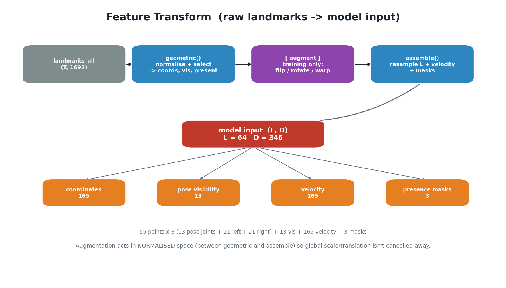
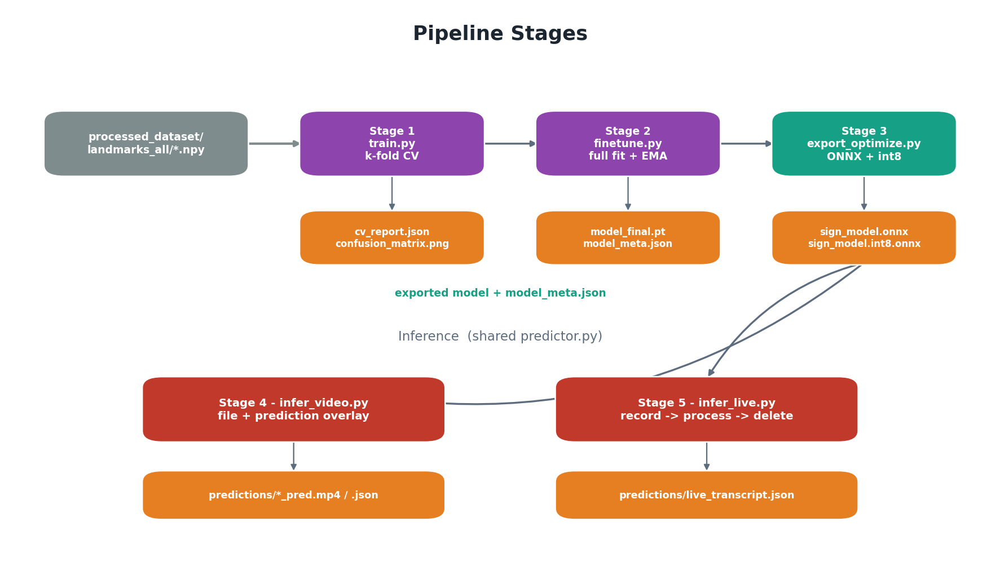

# 03 — Pipeline

This is the data flow from a raw landmark clip to a recognised sign: first the
shared **feature transform**, then the **five stages**.

```
data/processed_dataset/landmarks_all/<class>/<stem>.npy   (T, 1692)
        │
        ▼  features.geometric()      normalise + select  -> coords (T,P,3), vis, present
        │  [data.augment()]          training only: flip / rotate / scale / jitter / time-warp
        ▼  features.assemble()       resample to L + velocity + masks  -> (L, D)
        │
   ┌────┴─────────────────────────────────────────────────┐
   │ STAGE 1 train.py   k-fold CV     -> cv_report.json     │
   │ STAGE 2 finetune.py full fit+EMA -> model_final.pt     │
   │ STAGE 3 export      ONNX + int8  -> sign_model.onnx    │
   │ STAGE 4 infer_video file + overlay                     │
   │ STAGE 5 infer_live  motion-gated live segments         │
   └───────────────────────────────────────────────────────┘
```



## The feature transform (`features.py`)

A clip becomes a fixed `(L, D)` tensor in three deterministic steps. It is split
so augmentation can act in the *normalised coordinate space* (see `02`).

### Stage 1 — `geometric(all_vec)` → `coords, vis, present`
1. **Slice** the `(T, 1692)` vector into pose `(T,33,4)`, face `(T,478,3)`, left
   hand and right hand `(T,21,3)` (`split_blocks`).
2. **Presence** per modality per frame: a block is "detected" if its x/y/z is not
   all-zero (`_present`).
3. **Spatial normalisation** (`_reference` + `norm_xyz`): subtract the **mid-shoulder**
   point and divide by the **shoulder width**, using ONE clip-level reference (the
   median over frames where the pose is present). This gives translation + scale
   invariance, robust to per-frame dropouts. If shoulders can't be measured, fall
   back to `fallback_scale = 0.25`.
4. **Select** the enabled points: curated 13 upper-body pose joints + both hands
   (face off by default). Pose **visibility** is kept as a separate channel.
5. **Re-zero absent blocks** *after* normalisation so a missing hand stays at the
   origin instead of being pushed to `-origin/scale` (a ghost hand).

### Stage 2 — `assemble(coords, vis, present)` → `(L, D)`
1. **Temporal resample** every channel to a fixed `L = seq_len` frames — linear
   interpolation for coordinates/visibility, nearest-neighbour for masks (keeps
   0/1 crisp). Clips are 14–286 frames; all become exactly `L`.
2. **Velocity**: append the first-difference (frame-to-frame motion) of the
   coordinates.
3. **Masks**: append the per-modality presence channels (pose / left / right).
4. **Concatenate** → `(L, D)`. For the default config, `D = 346`:
   `165 (coords) + 13 (vis) + 165 (velocity) + 3 (masks)`.

`to_features()` is the no-augment wrapper used at inference; `feature_dim()`
computes `D` for a config without needing real data.

### Flip permutations (`build_spec` / `FeatureSpec`)
`build_spec()` precomputes the index permutations used by the horizontal-flip
augment: swap left/right hand points, swap symmetric pose joints
(`POSE_FLIP_PAIRS`), and swap the two hand mask columns. Flipping is an
involution (flip twice = identity), checked in `features.py`'s self-test.

## Augmentation (`data.augment`, training split only)

Applied in normalised space, between `geometric` and `assemble`:
- **Temporal**: per-frame dropout, then a random sub-window (speed warp).
- **Horizontal flip** (`aug_flip_prob = 0.5`): point permutation + negate x +
  swap hand presence — a right-handed clip becomes a valid left-handed one.
- **Geometric**: small rotation (±13°), scale (±12%), translation (±0.06),
  Gaussian jitter — then absent points are re-zeroed so they stay at the origin.

`data.load_geometric()` runs `geometric()` **once per clip** and caches the
result in memory; each epoch only pays for augment + assemble.



## Stage 1 — `train.py` (k-fold cross-validation)

1. `stratified_folds()` splits clips into `k = 5` validation folds, each class
   spread evenly.
2. For each fold: train on the other folds (augmentation on), validate on the
   held-out fold (augmentation off), keep the **best val-acc weights**, and record
   the fold's validation predictions.
3. Stitched together, the per-fold validation predictions are the **out-of-fold
   (OOF)** prediction for every clip — an honest whole-dataset accuracy + confusion
   matrix.
4. Schedule: AdamW + linear **warmup** then **cosine decay** to `min_lr`; gradient
   clipping; early stopping on val-acc patience.
5. Writes `cv_report.json`, `confusion_matrix.png`, `cv_folds.png`, `history.png`,
   and per-fold `fold{k}.pt`.

## Stage 2 — `finetune.py` (deployment fit)

1. Train on **100% of the clips** (no held-out set) with the same augmentation
   and schedule.
2. Maintain an **Exponential Moving Average (EMA)** of the weights with decay
   warmup (`min(0.999, (1+step)/(10+step))`) so the average tracks closely on a
   short, small-data run.
3. At the end, evaluate EMA vs raw weights on the (no-aug) training clips and
   **ship whichever fits better** (EMA usually wins) — guaranteeing the shipped
   model is never worse than the last raw step.
4. Optionally **warm-start** from a fold checkpoint (`--init-from fold3`).
5. Writes `model_final.pt` (weights + full self-describing meta) and
   `model_meta.json`.

## Stage 3 — `export_optimize.py` (ONNX)

1. Load `model_final.pt`, rebuild the network, load weights.
2. **Export to ONNX** (opset 17; batch axis dynamic, sequence length fixed at `L`).
3. **Verify** ONNX Runtime outputs ≈ PyTorch outputs (random batches + a real
   clip); reports max abs logit diff (observed ~1.7e-6).
4. **Dynamic int8 quantization** → smaller/faster CPU model; re-verify top-1
   class agreement with fp32.
5. Copy `model_meta.json` beside the ONNX (with `onnx` / `onnx_int8` filenames)
   so inference needs nothing else. Report file sizes + measured CPU latency.

## Stage 4 — `infer_video.py` (file inference)

1. `video_to_clip()` runs the project's **own** `extract_clip` + `build_all_vector`
   → the same `(T, 1692)` raw vector the dataset uses.
2. `SignPredictor.predict()` → whole-clip class + top-k.
3. `timeline()` slides a window (default 48 frames, stride 12) for a per-segment
   "subtitle" sequence; windows below `CONF_THRESH = 0.45` show "...".
4. `render_overlay()` draws the saved landmarks on the original frames (same look
   as the dataset's verify overlay) with the prediction as a banner subtitle →
   `predictions/<stem>_pred.mp4` + `.json`.
5. `--scan-dataset` batch-tests the first N source videos per class.

## Stage 5 — `infer_live.py` (live translation)

The **record → process → delete** loop, now **motion-gated** so a recording is
exactly as long as the sign instead of a fixed clock window (see `segmenter.py`
and `docs/LIVE_FIX.md` for the full reasoning):

1. `segmenter.MotionSegmenter` watches a cheap per-frame motion signal and
   **opens** a recording when the hands start moving, **closes** it when the
   signer is still for `--still` seconds (gaps between signs become an explicit
   LISTENING state, never classified).
2. The closed segment is written to a **temp file** under `live_tmp/` and run
   through the **same** `video_to_clip` + predictor as offline.
3. `predictor.predict_robust()` averages the whole-clip softmax with sliding
   sub-window votes; the sign is emitted only if confidence ≥ `--conf`, the
   **top1–top2 margin** ≥ `--margin` (rejects look-alike ties), and hands were
   actually seen (>15% of frames).
4. `segmenter.SignDebouncer` suppresses an immediately-repeated sign within
   `--repeat-window` seconds, so "no, no, no" reads as one **no**.
5. **Delete** the temp file (it is a cache file). Repeat continuously.
6. `--source <video>` simulates the loop from a file (testable without a
   camera); a transcript is saved to `predictions/live_transcript.json`.

Using a temp file (not a pure in-memory buffer) is deliberate: it reuses the
exact, already-verified extraction path, so live output matches offline output.
