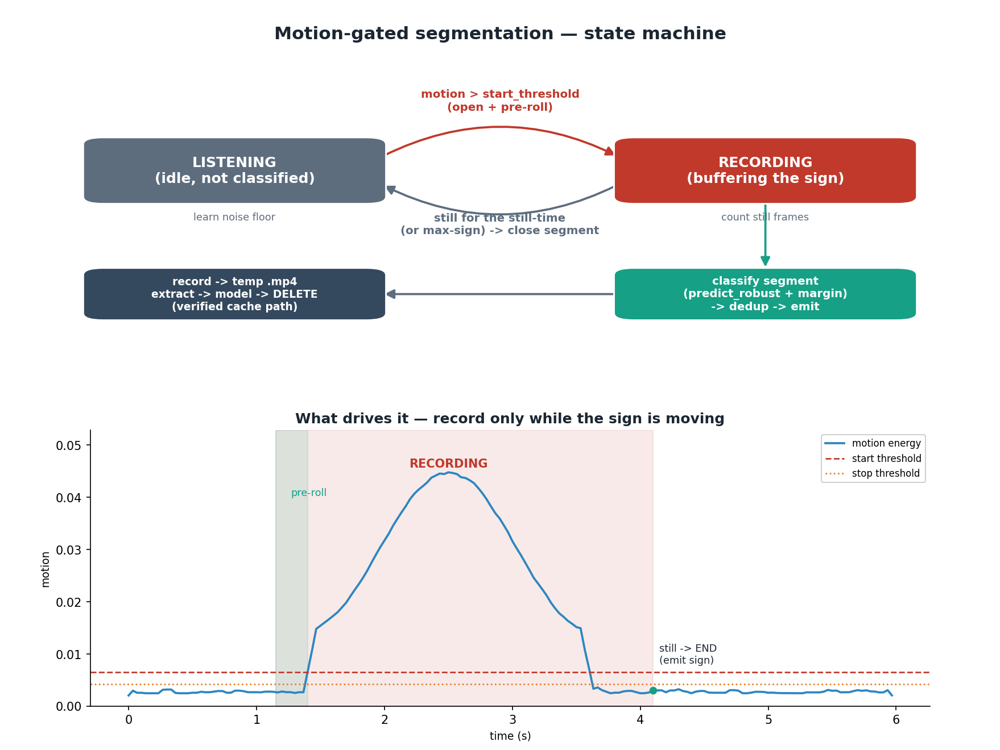

# Live Translation Fix — Motion-Gated Signs, Margin Gating & De-duplication

This note explains three problems seen while testing the **live** translator and
exactly how they were solved. It is written so you can follow the reasoning from
my side, not just read the final code.

> Scope: only the **serving / live** path changed (`infer_live.py`, a new
> `segmenter.py`, and a small `predictor.py` addition). The dataset, the trained
> model, and the offline file-test path were **not** retrained or altered.

---

## 1. The three problems you reported

1. **Some signs get confused.** A few signs are recognised as a different,
   look-alike sign.
2. **The previous sign sticks.** After you change to a new sign, the screen keeps
   showing the *previous* word for a while.
3. **Repeats are printed many times.** Doing one sign repeatedly prints the same
   word again and again.

You also proposed the right fix yourself: instead of a **fixed 2-second**
recording, record **until the sign actually ends** (detect "no more movement" =
sign finished), then process — and remove duplicate words.

---

## 2. Cross-check of the model and the code

### The model is fine
5-fold cross-validation on the processed dataset:

| Metric | Value |
|---|---|
| Out-of-fold accuracy | **91.0%** |
| Macro F1 | **0.909** |
| Mean fold accuracy | 0.911 ± 0.029 |
| Clips / classes | 134 / 12 |

So the network itself is healthy. The confusions it *does* have are between signs
that genuinely look alike, on a small dataset (~11 clips per class):

| True sign | Most confused with | Rate |
|---|---|---|
| good | help | 18% |
| me | sorry | 10% |
| sorry | me / you | 10% / 10% |
| help | good | 10% |
| hello | how_are_you | 9% |


These are **inherent** look-alike pairs — not a bug. Retraining can shrink them
(see §7), but the bigger live-time wins come from the serving changes below.

### The bug was in the live loop, not the model
The old `infer_live.py` recorded **fixed 2.5 s chunks**, classified each, and
showed the result as a subtitle. Reading that code against your symptoms:

- **Why signs blended.** A fixed window does not line up with where a sign starts
  and stops, so one chunk holds the *tail* of sign A plus the *start* of sign B.
  The model attention-pools the whole chunk and reports whichever dominated.
- **Why the previous sign stuck.** The model has **no "idle / no-sign" class** —
  it is forced to output one of the 12 signs for *every* chunk, including a chunk
  where you were just resting between signs. A held, still hand keeps looking
  like the last sign, so the old word persists. The banner also showed the
  previous result during the next 2.5 s recording, adding visible lag.
- **Why repeats spammed.** Each chunk emits independently, so a held/repeated sign
  produces the same word every chunk.

The root cause is **segmentation**: classifying on a clock instead of on the sign.

---

## 3. The solution in one picture



Record **exactly as long as the sign lasts**. A cheap per-frame *motion signal*
opens a recording when your hands start moving and closes it when you go still.
The pause between signs becomes an explicit **LISTENING** state that is never
classified — so a stale word can no longer be mistaken for a live detection.

The verified `record -> temp file -> extract -> model -> delete` cache method is
kept exactly; only **when** a recording starts and stops is new.

---

## 4. How it works, step by step

### 4.1 Motion signal (cheap, every frame)
Each incoming frame is shrunk to ~120 px tall, grayscaled and blurred, then the
mean absolute difference against the previous frame is taken. That scalar
("motion energy") is small when you are still and several times larger while
signing. Its absolute scale depends on how large you are in frame (a webcam
close-up moves far more pixels than a signer who is small in a 1080p clip) —
which is exactly why the thresholds are **auto-calibrated** below rather than
hard-coded. It costs microseconds — far cheaper than running the full landmark
model every frame.

### 4.2 Auto-calibrated thresholds (adapts to your room)
Absolute motion values depend on camera and lighting, so thresholds are set
**relative to a learned noise floor** — the residual motion seen while idle:

```
start_threshold = max(floor, noise x motion_start)   # default motion_start = 2.6
stop_threshold  = max(floor, noise x motion_stop)    # default motion_stop  = 1.7
```

`motion_start > motion_stop` gives **hysteresis**: once recording starts it will
not flicker off on a brief dip. The floor tracks the *quiet baseline* — it
follows a lull down quickly but rises only very slowly — so a sustained sign can
never inflate its own threshold (an earlier averaging version did, and a
small-in-frame signer then never crossed it).

### 4.3 The state machine (`MotionSegmenter`)

1. **LISTENING.** Update the noise floor. When smoothed motion rises above
   `start_threshold`, open a recording — seeded with a short **pre-roll** (the
   last ~0.25 s) so the onset of the sign is not clipped.
2. **RECORDING.** Buffer every frame. Count consecutive **still** frames (motion
   below `stop_threshold`). Reset that counter the moment motion returns.
3. **END.** When stillness lasts `still` seconds (default 0.5 s) — or the
   recording hits `max-sign` seconds — close the segment, trim the trailing
   stillness, and hand the frames off for classification. A segment shorter than
   `min-sign` is discarded as a twitch.

The result is a **variable-length** clip that tightly contains one sign.

### 4.4 Robust classification with a margin (`predict_robust`)
A single whole-clip pass can be tipped between look-alikes (good/help) by a few
ambiguous frames. The closed segment is instead classified by **averaging the
softmax over the whole clip plus overlapping sub-windows** — a cheap ensemble.
It returns the winner, its confidence, and the **top1–top2 margin**.

A sign is **emitted only if** `confidence >= conf` **and** `margin >= margin`
**and** hands were actually present. On a near-tie (e.g. good 0.45 / help 0.43)
the margin is tiny, so the loop shows `?` instead of committing to a guess —
directly attacking problem #1 at serve time.

### 4.5 De-duplication (`SignDebouncer`)
When a segment is emitted, an immediately-repeated sign within `repeat-window`
seconds (default 4 s) is suppressed, so "no, no, no" reads as a single **no**. A
*different* sign always passes; the same sign passes again only after a clear
pause (an intentional repeat). `--no-dedup` turns this off.

### 4.6 Clearer on-screen state
The overlay now shows **LISTENING** (grey) vs **● REC** with a live motion bar,
and flashes a recognised sign in green for ~1 s. A stale word can no longer be
confused for a live one.

---

## 5. Where each piece lives

| File | What it adds |
|---|---|
| `training/segmenter.py` | **new** — `MotionSegmenter` (motion + state machine) and `SignDebouncer` (repeat suppression). Pure logic with a built-in self-test. |
| `training/predictor.py` | `predict_robust()` + `_probs()` — multi-window softmax averaging and the top1–top2 margin. |
| `training/infer_live.py` | rewritten loop: motion-gated record -> temp -> extract -> model -> delete, margin gating, dedup, clearer overlay. The `--source` path runs the same machine for camera-free testing. |

---

## 6. Tuning reference

All are command-line flags on `infer_live.py` (sensible defaults shown):

| Flag | Default | Effect |
|---|---|---|
| `--still` | 0.5 s | Stillness needed to declare a sign finished. Raise if your signs have mid-pauses; lower for snappier cut-off. |
| `--min-sign` | 0.5 s | Shorter segments are discarded as twitches. |
| `--max-sign` | 5.0 s | Hard cap; a sign is force-closed after this. |
| `--motion-start` | 2.6 | Higher = needs a bigger move to start (fewer false starts). |
| `--motion-stop` | 1.7 | Lower = needs more stillness to stop (avoids early cut-off). |
| `--floor` | 0.0025 | Absolute anti-noise motion floor for a very still scene. |
| `--preroll` | 0.25 s | Frames kept before the onset so the start isn't clipped. |
| `--conf` | 0.55 | Minimum top-1 confidence to emit. |
| `--margin` | 0.15 | Minimum top1–top2 gap to emit (raise to 0.2 to be stricter on look-alikes). |
| `--repeat-window` | 4.0 s | Window in which an identical sign is treated as a repeat. |
| `--no-dedup` | off | Emit every segment, including repeats. |

### Run it
```
# webcam
python training/infer_live.py
python training/infer_live.py --margin 0.2 --still 0.6      # stricter

# no camera — simulate live from a file (exercises the same state machine)
python training/infer_live.py --source good.mp4
```

---

## 7. Honest limits & where to go next

- **Frame-difference motion** reacts to any large movement (e.g. a big head
  turn). The minimum-duration filter plus the hands-present check reject most
  noise; a stricter upgrade is to gate on **hand-landmark velocity** instead of
  whole-frame motion.
- **Look-alike pairs** (good/help, me/sorry) are dataset-limited. The margin gate
  hides bad guesses but does not *add* knowledge. To actually separate them:
  collect more clips for those classes, add a **"rest / no-sign" negative class**
  so idle is modelled explicitly, and consider class-balanced sampling.
- **Mid-sign pauses.** A sign with a long internal hold can be split into two
  segments. Raise `--still` if your signing style pauses mid-gesture.

The net effect: recording now matches the sign instead of a clock, confident
look-alike mistakes are withheld instead of shown, and repeats collapse to one
word — which together remove the "previous sign sticks" behaviour you saw.
